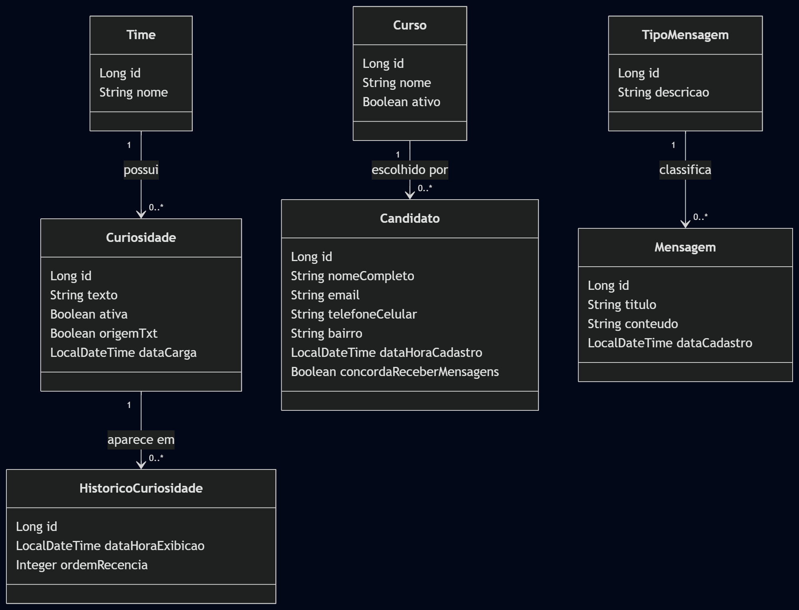
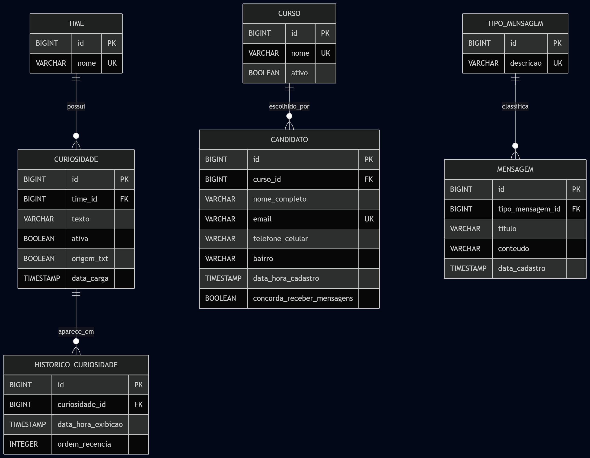

# Portal Vestibular Fatec ZL - Requisitos e Modelagem

## 1) Escopo
Aplicacao Java Web com **Spring Boot**, **Spring Web** e **Spring Data JPA** para:
1. Entreter visitantes (oraculo com curiosidades de futebol).
2. Cadastrar potenciais candidatos para contato sobre vestibular.
3. Disponibilizar telas administrativas ocultas para manutencao e consultas.

## 2) Requisitos Funcionais (RF)
- **RF-01**: O sistema deve exibir uma tela inicial em tela cheia com imagens relacionadas a times de futebol.
- **RF-02**: O sistema deve disponibilizar um link para a tela de escolha de time, contendo as opcoes Corinthians, Palmeiras, Santos e Sao Paulo.
- **RF-03**: O sistema deve verificar, ao abrir a tela de escolha do time, se as tabelas de dominio ja foram populadas.
- **RF-04**: O sistema deve carregar os dados iniciais a partir de arquivos TXT localizados em `src/main/resources/txts`, caso as tabelas ainda nao estejam populadas.
- **RF-05**: O sistema deve carregar 1 arquivo TXT para a tabela de times e 1 arquivo TXT para cada time com, no minimo, 15 curiosidades positivas.
- **RF-06**: O sistema deve permitir que o usuario selecione um time e receba uma curiosidade aleatoria correspondente.
- **RF-07**: O sistema deve redirecionar automaticamente o usuario, apos a exibicao da curiosidade, para a tela de cadastro no tempo de 15 segundos.
- **RF-08**: O sistema deve permitir o cadastro de candidatos com os dados: nome completo, e-mail, telefone celular, bairro e curso de interesse.
- **RF-09**: O sistema deve registrar automaticamente a data e a hora do cadastro do candidato.
- **RF-10**: O sistema deve exibir um aviso de consentimento para recebimento de mensagens sobre vestibular.
- **RF-11**: O sistema deve disponibilizar uma tela oculta `cadastraTipo.jsp`, acessivel apenas mediante validacao de login e senha.
- **RF-12**: O sistema deve permitir, na tela `cadastraTipo.jsp`, o cadastro, a modificacao, a consulta simples e a listagem de mensagens por tipo.
- **RF-13**: O sistema deve disponibilizar uma tela oculta `consultaCandidatos.jsp`, acessivel apenas mediante validacao de login e senha.
- **RF-14**: O sistema deve permitir a consulta de candidatos por curso escolhido.
- **RF-15**: O sistema deve permitir a consulta de candidatos por bairro.
- **RF-16**: O sistema deve permitir a consulta de todos os candidatos ordenados por curso escolhido.
- **RF-17**: O sistema deve permitir a consulta de todos os candidatos ordenados por bairro.
- **RF-18**: O sistema deve permitir a consulta dos 10 primeiros candidatos cadastrados.
- **RF-19**: O sistema deve permitir a consulta dos 10 ultimos candidatos cadastrados.
- **RF-20**: O sistema deve permitir a manutencao das entidades definidas por meio das camadas view, model, controller e repository.

## 3) Requisitos Nao Funcionais (RNF)
- **RNF-01**: A aplicacao deve ser desenvolvida utilizando Spring Boot, Spring Web e Spring Data JPA.
- **RNF-02**: A aplicacao deve utilizar persistencia em banco de dados relacional com tabelas normalizadas.
- **RNF-03**: Os arquivos TXT de carga inicial devem estar localizados em `src/main/resources/txts`.
- **RNF-04**: A autenticacao administrativa nao deve utilizar Spring Security.
- **RNF-05**: A aplicacao deve utilizar JSP como tecnologia de visao.
- **RNF-06**: O sistema deve garantir integridade e consistencia dos dados no banco.
- **RNF-07**: A aplicacao deve utilizar procedures, triggers e UDFs conforme definido nas regras de negocio e restricoes do projeto.
- **RNF-08**: O sistema deve possuir interface adequada para uso em tela cheia.

## 4) Regras de Negocio (RN)
- **RN-01**: A curiosidade exibida ao usuario deve pertencer ao time selecionado.
- **RN-02**: O sistema nao deve repetir nenhuma das 3 ultimas curiosidades exibidas.
- **RN-03**: A cada nova curiosidade exibida, a ocorrencia mais antiga entre as 3 ultimas deve ser substituida logicamente.
- **RN-04**: O cadastro do candidato deve registrar automaticamente data e hora.
- **RN-05**: Apos cadastrado, o candidato nao pode ser alterado nem excluido da base de dados.
- **RN-06**: As mensagens de curiosidade carregadas para o oraculo nao podem ser alteradas nem excluidas da base.
- **RN-07**: O acesso as telas ocultas deve ocorrer apenas mediante login `admin` e senha `Jej-W+q%`.
- **RN-08**: A validacao de login e senha deve ser realizada por procedure simples.
- **RN-09**: A regra de selecao da curiosidade deve utilizar uma UDF e uma Stored Procedure.
- **RN-10**: As regras de imutabilidade e consistencia referentes a candidatos e mensagens devem ser garantidas por triggers.
- **RN-11**: O curso informado no cadastro do candidato deve pertencer ao catalogo da Fatec ZL.

## 5) Modelo de Classes (Mermaid)
Arquivo do diagrama: 

## 6) Modelo ER (Mermaid)
Arquivo do diagrama: 

## 7) Consultas esperadas na camada Repository
- **findBy**: `findByCursoId(Long cursoId)`, `findByBairroIgnoreCase(String bairro)`.
- **JPQL**: `select c from Candidato c order by c.curso.nome`.
- **Nativa**: `select * from candidato order by data_hora_cadastro asc limit 10` e equivalente desc.

## 8) Estrutura de TXT esperada
- `txts/times.txt` -> lista de times.
- `txts/corinthians.txt` -> curiosidades do Corinthians.
- `txts/palmeiras.txt` -> curiosidades do Palmeiras.
- `txts/santos.txt` -> curiosidades do Santos.
- `txts/saopaulo.txt` -> curiosidades do Sao Paulo.

Cada arquivo de curiosidades deve conter no minimo 15 linhas.